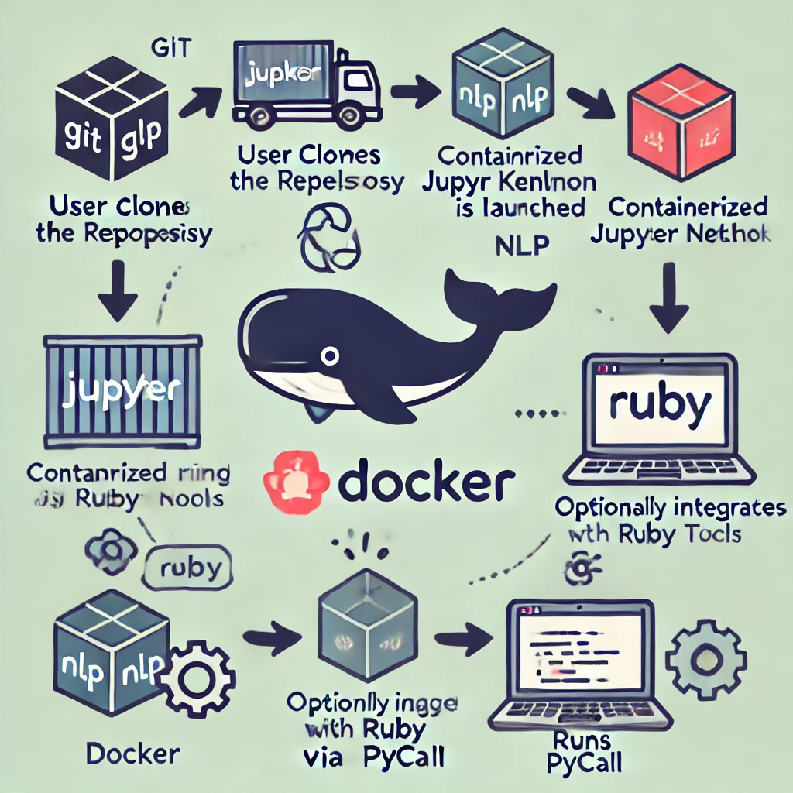

# Jupyter Notebook with Ruby Kernel & NLP Gems

[](https://github.com/b08x/jupyter-ruby-docker/actions/workflows/ci.yml)

Based on RubyData's [docker-stacks](https://github.com/RubyData/docker-stacks) and the official [Jupyter Docker Stacks](https://github.com/jupyter/docker-stacks).

<div style="float: left; margin-right: 20px;">
  
</div>
This project provides Docker images that bundle a Jupyter Notebook server preconfigured with a Ruby kernel (IRuby) and a comprehensive suite of RubyGems focused on Natural Language Processing (NLP) and language model utilities.

## Features

- **Ruby Kernel for Jupyter**: Use IRuby to run Ruby code interactively within Jupyter notebooks.
- **NLP Libraries**: Includes gems for text tokenization, sentiment analysis, entity extraction, and various language utilities.
- **Cross-Language Integration**: Leverage Python libraries (like spaCy, NLTK, Transformers) from Ruby via [pycall](https://github.com/mrkn/pycall.rb) for mixed-language workflows.
- **Data Analysis**: Utilize gems like [daru](https://github.com/SciRuby/daru) and [daru-view](https://github.com/SciRuby/daru-view) for data manipulation and visualization.
- **Vector Database Integration**: Includes `pgvector`, `chroma-db` and `redis` services via Docker Compose for vector similarity searches.
- **TTY Gem Suite**: Includes components from the [TTY-Toolkit](https://ttytoolkit.org/) to create great Terminal Apps.

## Prerequisites

- [Podman](https://podman.io/getting-started/installation) installed on your machine (or [Docker](https://www.docker.com/get-started) if you prefer).
- [Podman Compose](https://github.com/containers/podman-compose) or [Docker Compose](https://docs.docker.com/compose/install/) (Recommended for full functionality).
- Basic familiarity with Jupyter Notebooks and container commands.

**Note**: This project uses Podman as the primary container runtime (OCI-compliant Containerfiles). All `podman` commands can be replaced with `docker` if you prefer using Docker.

## Building the Images

The project contains two primary container images: `base` and `nlp`.

- **[base](./base/README.md)**: A foundational image built upon `jupyter/docker-stacks-foundation`, including JupyterLab, common Python data science libraries, and essential NLP tools like spaCy and Google Generative AI SDK.
- **[nlp](./nlp/README.md)**: Built upon the `base` image, this adds Ruby 3.3.8, IRuby kernel, and a comprehensive suite of 100+ Ruby gems for NLP, LLM integration, and vector search.

1. **Clone the Repository**

    ```bash
    git clone https://github.com/b08x/jupyter-ruby-docker.git
    cd jupyter-ruby-docker
    ```

2. **Build the Images**

    You can build the images individually using `podman build` or use the provided `Rakefile`:

    - **Using Podman Build (NLP image, depends on base):**

        ```bash
        # Build the base image first (if not pulled from a registry)
        podman build -t b08x/notebook-base:latest -f base/Containerfile .

        # Build the NLP image
        podman build -t b08x/notebook-nlp:latest -f nlp/Containerfile .
        ```

        **Docker users**: Replace `podman` with `docker` in the commands above.

    - **Using Rake (Recommended):**

        ```bash
        # Install rake if not already installed
        bundle install

        # Build the nlp image (uses Podman by default, builds base automatically if needed)
        rake build/nlp

        # Or build all defined images
        rake build-all
        ```

        The Rakefile uses Podman by default but can be configured to use Docker by modifying the `CONTAINER_RUNTIME` variable.

## Running the Container

You can run the `nlp` image using either `podman run` or `podman-compose`. Using compose is recommended as it also sets up the `redis` and `pgvector` services defined in `compose.yaml`.

### Using `podman run` (Notebook only)

This method starts only the Jupyter notebook container.

```bash
podman run --rm -p 8888:8888 \
  -v "${PWD}/work":/home/jovyan/work \
  --user $(id -u):$(id -g) \
  b08x/notebook-nlp:latest
```

**Docker users**: Replace `podman` with `docker` in all commands.

**Explanation:**

- `--rm`: Automatically remove the container when it exits.
- `-p 8888:8888`: Map port 8888 on your host to port 8888 in the container.
- `-v "${PWD}/work":/home/jovyan/work`: Mount a local directory named `work` into the container's home directory. **Create this directory (`mkdir work`) in your project folder first.** This allows you to persist your notebooks and data.
- `--user $(id -u):$(id -g)`: Run the container using your current user and group ID to avoid permission issues with mounted volumes.
- `b08x/notebook-nlp:latest`: The image to run.

**Access Jupyter:** Open your browser and go to `http://localhost:8888`. The startup logs in your terminal will display an authentication token—use it to log in.

**Note**: Jupyter is configured with remote access enabled. To connect from another machine on your network, use `http://<your-machine-ip>:8888` with the token.

### Using Compose (Recommended: Notebook + Redis + PGVector)

This method uses the `compose.yaml` file to start the `nlp-notebook`, `redis`, and `pgvector` services together.

1. **Environment Setup (`.env` file):**
    Copy the example environment file (`.env.example`) to `.env` and configure the variables:

    ```bash
    cp .env.example .env
    ```

    Edit the `.env` file to set the following:
    - **`UID` & `GID`**: (Optional) Set these to your user and group ID (`id -u` and `id -g`) if they are not 1000. This ensures correct file permissions for mounted volumes.
    - **`WORKSPACE`**: (Optional) Set this to the **absolute path** of the directory on your host machine where you want to store your notebooks and work files. If left empty or undefined, the `compose.yaml` will default to mounting a `./data` directory (relative to the project root) into the container at `/home/jovyan/work`.
    - **API Keys**: (Optional) Set `OPENAI_API_KEY`, `GOOGLE_PALM_API_KEY`, and `HUGGINGFACE_API_KEY` if you plan to use services requiring them within your notebooks.

2. **Create Necessary Directories:**
    Depending on your `.env` configuration and the `compose.yaml` settings, ensure the necessary host directories exist before starting the services.
    - **If `WORKSPACE` is set in `.env`:** Make sure the directory specified by `WORKSPACE` exists.

      ```bash
      # Example if WORKSPACE=/path/to/my/notebooks
      mkdir -p /path/to/my/notebooks
      ```

    - **If `WORKSPACE` is *not* set in `.env`:** Create the default `./data` directory.

      ```bash
      mkdir -p ./data
      ```

    - **For the read-only Library mount:** The default `compose.yaml` also mounts `$HOME/Documents` as read-only to `/home/jovyan/Library`. Ensure this directory exists if you intend to use it.

      ```bash
      mkdir -p ~/Documents
      ```

3. **Start Services:**

    ```bash
    podman-compose up -d
    # or for Docker users:
    docker compose up -d
    ```

    - `-d`: Run containers in detached mode (in the background).

    **Note**: Use `podman-compose` or `docker compose` (v2), not the older `docker-compose` command.

4. **Access Services:**
    - **Jupyter Lab**: Open `http://localhost:8888`. Get the token from logs: `podman-compose logs nlp-notebook`
    - **RedisInsight**: Open `http://localhost:8001` for Redis management UI
    - **PostgreSQL + pgvector**: Available at `localhost:5432` (database: `rubynlp`, user: `postgres`)

5. **Stopping Services:**

    ```bash
    podman-compose down
    # or for Docker users:
    docker compose down
    ```

## Overview of Included RubyGems

For a complete list, review the [nlp/README](./nlp/README.md).

## Illustrative Examples

The following examples demonstrate key capabilities of the stack. Launch Jupyter and create a new Ruby notebook to try them out.

### Example 1: NLP Text Processing Pipeline

This example shows multilingual text analysis using ruby-spacy with named entity recognition.

```ruby
require 'ruby-spacy'
require 'terminal-table'

# Initialize spaCy with English model
nlp = Spacy::Language.new('en_core_web_sm')

# Process text and extract entities
text = "Apple Inc. is planning to open a new store in San Francisco."
doc = nlp.read(text)

# Display entities in a table
rows = []
doc.ents.each do |ent|
  rows << [ent.text, ent.label, ent.start_char, ent.end_char]
end

table = Terminal::Table.new(
  headings: ['Entity', 'Type', 'Start', 'End'],
  rows: rows
)
puts table
# Output:
# +-----------+-------+-------+-----+
# | Entity    | Type  | Start | End |
# +-----------+-------+-------+-----+
# | Apple Inc | ORG   | 0     | 9   |
# | San Fran  | GPE   | 40    | 53  |
# +-----------+-------+-------+-----+
```

**Why this matters**: Ruby-spacy bridges Ruby and Python's powerful spaCy library via pycall, giving you production-grade NLP without leaving Ruby.

### Example 2: LLM Integration with LangChain

Build a conversational AI assistant with tool calling and structured prompts.

```ruby
require 'langchain'

# Initialize LLM (supports OpenAI, Groq, Ollama, etc.)
llm = Langchain::LLM::OpenAI.new(
  api_key: ENV['OPENAI_API_KEY'],
  default_options: { temperature: 0.7, chat_model: 'gpt-4' }
)

# Create an assistant with instructions
assistant = Langchain::Assistant.new(
  llm: llm,
  instructions: "You're a helpful Ruby programming expert"
)

# Have a conversation
assistant.add_message_and_run!(
  content: "Explain the difference between a proc and a lambda in Ruby"
)

# Access the conversation thread
puts assistant.messages.last.content
```

**Structured output example** with JSON schema:

```ruby
require 'langchain'

json_schema = {
  type: "object",
  properties: {
    sentiment: { type: "string", enum: ["positive", "negative", "neutral"] },
    confidence: { type: "number", description: "Confidence score 0-1" },
    keywords: {
      type: "array",
      items: { type: "string" },
      description: "Key topics extracted"
    }
  },
  required: ["sentiment", "confidence", "keywords"]
}

parser = Langchain::OutputParsers::StructuredOutputParser.from_json_schema(json_schema)
prompt = Langchain::Prompt::PromptTemplate.new(
  template: "Analyze this text:\n{format_instructions}\n\nText: {text}",
  input_variables: ["text", "format_instructions"]
)

# Generate structured analysis
text = "I absolutely loved the new Ruby 3.3 features! Pattern matching is incredible."
prompt_text = prompt.format(
  text: text,
  format_instructions: parser.get_format_instructions
)

response = llm.chat(messages: [{ role: "user", content: prompt_text }])
analysis = parser.parse(response.chat_completion)
# => { "sentiment" => "positive", "confidence" => 0.95, "keywords" => ["Ruby 3.3", "pattern matching"] }
```

**Why this matters**: LangChain provides a unified API across 10+ LLM providers (OpenAI, Groq, Ollama, Google, etc.), making your code portable.

### Example 3: Vector Database & Semantic Search

Use PostgreSQL with pgvector for semantic similarity search.

```ruby
require 'sequel'
require 'pgvector'

# Connect to PostgreSQL with pgvector extension
DB = Sequel.connect('postgres://postgres@pgvector:5432/rubynlp')

# Enable pgvector extension
DB.run('CREATE EXTENSION IF NOT EXISTS vector')

# Create a table with vector column
DB.run <<-SQL
  CREATE TABLE IF NOT EXISTS documents (
    id SERIAL PRIMARY KEY,
    content TEXT,
    embedding vector(384)
  )
SQL

# Define a model with pgvector plugin
class Document < Sequel::Model
  plugin :pgvector, :embedding
end

# Insert documents with embeddings
# (In practice, use an embedding model like sentence-transformers)
Document.create(
  content: "Ruby is great for web development",
  embedding: [0.1, 0.2, 0.3, ...] # 384-dimensional vector
)

Document.create(
  content: "Python is widely used for data science",
  embedding: [0.15, 0.18, 0.25, ...] # 384-dimensional vector
)

# Perform similarity search using Euclidean distance
query_embedding = [0.12, 0.19, 0.28, ...] # Your query vector
similar_docs = Document.nearest_neighbors(
  :embedding,
  query_embedding,
  distance: 'euclidean'
).limit(5)

similar_docs.each do |doc|
  puts "#{doc.content} (distance: #{doc.values[:distance]})"
end
```

**Create an index for faster searches** (use after inserting bulk data):

```ruby
# HNSW index for approximate nearest neighbor search
DB.add_index :documents, :embedding, type: 'hnsw', opclass: 'vector_l2_ops'
```

**Why this matters**: Vector databases enable semantic search, RAG (Retrieval Augmented Generation), and similarity-based recommendations. pgvector integrates directly into PostgreSQL, avoiding the need for separate vector databases.

### Example 4: Caching LLM Responses with Redis

Use Redis (via Ohm) to cache expensive LLM calls and avoid redundant API requests.

```ruby
require 'ohm'
require 'langchain'

# Ohm connects to Redis automatically via OHM_URL env var
# (Set in compose.yaml: redis://redis:6379/1)

class LLMResponse < Ohm::Model
  attribute :prompt
  attribute :response
  attribute :model
  index :prompt  # Enables fast lookups by prompt

  def self.cached_or_fetch(prompt, model:)
    # Check cache first
    cached = find(prompt: prompt, model: model).first
    return cached.response if cached

    # Cache miss: fetch from LLM
    llm = Langchain::LLM::OpenAI.new(api_key: ENV['OPENAI_API_KEY'])
    result = llm.chat(
      messages: [{ role: "user", content: prompt }]
    )
    response_text = result.chat_completion

    # Store in cache
    create(
      prompt: prompt,
      response: response_text,
      model: model
    )

    response_text
  end
end

# Usage:
response = LLMResponse.cached_or_fetch(
  "Explain closures in Ruby",
  model: "gpt-4"
)
puts response  # Subsequent calls with same prompt return instantly from cache
```

**Why this matters**: LLM API calls are slow and expensive. Caching dramatically improves response times and reduces costs for repeated queries.

## Customization & Development

You can customize the container images in several ways:

- **Ruby Version:** Ruby is pinned to version 3.3.8 for stability. To change versions, edit `nlp/Containerfile` and update the `RUBY_VERSION` build argument.
- **Ruby Gems:** To add or update Ruby gems, modify `nlp/Gemfile`, then rebuild using `rake build/nlp` or `podman build -f nlp/Containerfile .`. The project uses `Gemfile.lock` for reproducible builds. Run `bundle update` to update dependencies.
- **Python Packages:** To add or update Python packages, edit the `pip install` or `mamba install` commands in `base/Containerfile`. Rebuild both `base` and `nlp` images afterward.
- **System Packages:** Add system libraries via `apt-get install` in the appropriate Containerfile:
  - Use `base/Containerfile` for Python or base environment dependencies.
  - Use `nlp/Containerfile` for Ruby-specific or runtime dependencies.
- **Jupyter Configuration:** Modify settings in `base/jupyter_server_config.py`. Note: Remote access is enabled by default (`c.ServerApp.allow_remote_access = True`). Disable this if you only need local access.
- **Kernel Patching:** The `nlp/Containerfile` applies `respond_to_missing.patch` to the `ruby-spacy` gem for pycall compatibility. Customize this patch if needed and rebuild.

## Troubleshooting

### Build Issues

- **Verify resources**: Ensure your container runtime has sufficient memory (recommend 4GB+ for builds)
- **Check build logs**: For Podman: `podman build --no-cache -f nlp/Containerfile .` / For Docker: `docker build --no-cache -f nlp/Containerfile .`
- **Dependency conflicts**: If gem installation fails, check `nlp/Gemfile.lock` for version conflicts

### Podman-Specific Issues

- **Port binding with rootless Podman**: Ports below 1024 require privileges. Use ports ≥1024 or configure `sysctl`:

  ```bash
  # Allow rootless Podman to bind to ports < 1024
  echo "net.ipv4.ip_unprivileged_port_start=80" | sudo tee /etc/sysctl.d/podman-ports.conf
  sudo sysctl --system
  ```

- **SELinux volume mount errors**: If you see "permission denied" when accessing mounted volumes on Fedora/RHEL:
  - The `:Z` flag in `compose.yaml` handles this automatically
  - For manual runs, add `:Z` to volume mounts: `-v ./data:/home/jovyan/work:Z`

- **Compose command**: Use `podman-compose` or `docker compose` (v2), NOT the older `docker-compose`:

  ```bash
  # ✅ Correct
  podman-compose up -d
  docker compose up -d

  # ❌ Deprecated
  docker-compose up -d
  ```

### Jupyter & Access Issues

- **Kernel not appearing**: Ensure `iruby register --force` ran successfully during build. Check logs:

  ```bash
  podman logs <container_id>  # or: docker logs <container_id>
  ```

- **Remote access not working**:
  - Jupyter remote access is enabled by default in `base/jupyter_server_config.py`
  - Check firewall: `sudo firewall-cmd --add-port=8888/tcp --permanent` (Fedora/RHEL)
  - Verify the container is listening on `0.0.0.0`: `podman port <container_name>`

- **Token issues**: Get the Jupyter token from logs:

  ```bash
  podman-compose logs nlp-notebook | grep token
  # or
  docker compose logs nlp-notebook | grep token
  ```

### Port Conflicts

If ports 8888, 6379, or 5432 are already in use:

- **Option 1**: Stop conflicting services
- **Option 2**: Change ports in `compose.yaml`:

  ```yaml
  ports:
    - "8889:8888"  # Map host port 8889 to container port 8888
  ```

### Volume Permission Errors

- **With `podman run`/`docker run`**: Use `--user $(id -u):$(id -g)`
- **With compose**: Set `UID` and `GID` in `.env` to match your host user:

  ```bash
  echo "UID=$(id -u)" >> .env
  echo "GID=$(id -g)" >> .env
  ```

### Database Connection Issues

- **PostgreSQL not accessible**: Ensure the `pgvector` service is healthy:

  ```bash
  podman-compose ps  # Check if pgvector is "healthy"
  ```

- **Redis connection refused**: Check Redis is running on port 6379:

  ```bash
  podman exec -it redis redis-cli ping  # Should return "PONG"
  ```

## Recent Changes

### Version 1.1.0 (December 2024)

This release brings significant infrastructure improvements and enhanced capabilities:

- **🐳 Podman Migration**: Migrated from Docker to Podman as the primary container runtime
  - Renamed `Dockerfile` → `Containerfile` (OCI standard compliance)
  - Updated `docker-compose.yml` → `compose.yaml`
  - Rakefile now uses Podman by default (Docker still supported)

- **💎 Ruby Version Pinning**: Locked Ruby to version 3.3.8 for stability
  - Introduced `Gemfile.lock` for reproducible builds
  - Ensures consistent behavior across development and production environments

- **🌐 Jupyter Remote Access**: Enabled remote access capability
  - Configure `c.ServerApp.allow_remote_access = True` in `base/jupyter_server_config.py`
  - Access Jupyter from anywhere on your network (secure your deployment accordingly)

- **🤖 Local LLM Support**: Enhanced llama-cpp-python integration
  - Added `build-essential` and `gcc` to base image
  - Fixed PyPI index URL for reliable installation
  - Enables running local LLMs (Llama, Mistral, etc.) directly in notebooks

- **📚 Documentation Enhancements**:
  - Added comprehensive illustrative examples (NLP pipelines, LLM integration, vector search)
  - Podman-first documentation with Docker alternatives
  - Expanded troubleshooting guide with Podman-specific solutions

For full details, see the [git commit history](https://github.com/b08x/jupyter-ruby-docker/commits/main).

## License

This project is licensed under the MIT License. See the LICENSE file (if available) or assume MIT if missing. Base images used may have their own licenses (e.g., BSD for Jupyter Docker Stacks).

## Contributing

Contributions are welcome! Please fork the repository and submit pull requests.
