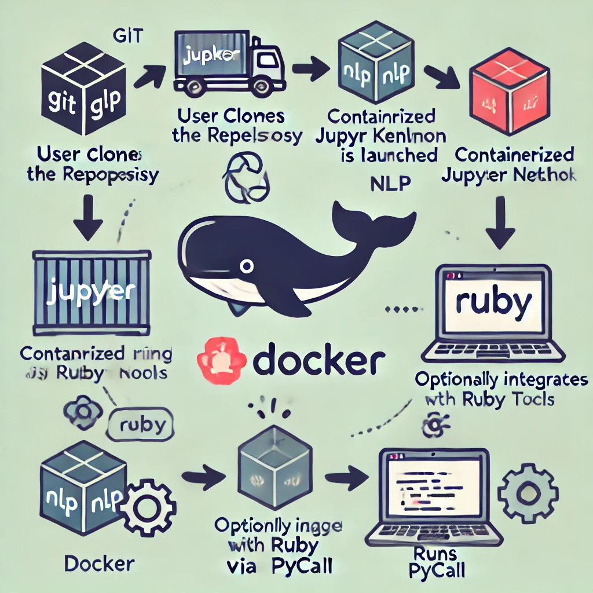

# Jupyter Notebook with Ruby Kernel & NLP Gems

[](https://github.com/b08x/jupyter-ruby-docker/actions/workflows/ci.yml)

This project provides a comprehensive environment for interactive data science and Natural Language Processing (NLP) using Ruby within Jupyter notebooks. It offers both CPU-based and NVIDIA GPU-accelerated Docker images, pre-configured with a Ruby kernel (IRuby) and a rich suite of gems for NLP, data analysis, and AI model interaction.

---
The setup is orchestrated with Docker Compose, which manages the Jupyter notebook services along with integrated Redis and Pgvector databases for advanced vector similarity searches.
<div align="right">
  
</div>

## Features

- **Dual Environments**: Choose between CPU and NVIDIA GPU-accelerated environments.
- **Ruby Kernel for Jupyter**: Run Ruby code interactively in Jupyter notebooks via IRuby.
- **Rich NLP Ecosystem**: A wide array of gems for tokenization, language detection, and text processing.
- **Python Interoperability**: Leverage powerful Python libraries like `spaCy`, `PyTorch`, and `NLTK` directly from Ruby using `pycall`.
- **Integrated Data Stores**: Includes `redis` (with Redis Stack) and `pgvector` services for in-memory caching and vector storage.
- **Data Analysis Tools**: Comes with `Daru` for data manipulation and `Daru-View` for plotting.
- **Comprehensive Tooling**: Includes the TTY toolkit for building terminal applications and numerous utilities for interacting with AI services.

## Prerequisites

- [Docker](https://www.docker.com/get-started)
- [Docker Compose](https://docs.docker.com/compose/install/)
- For GPU support:
  - An NVIDIA GPU
  - [NVIDIA Container Toolkit](https://docs.nvidia.com/datacenter/cloud-native/container-toolkit/latest/install-guide.html) installed on your host machine.

## Project Structure

The project is organized into two main components, each with CPU and GPU variations:

- **`base`**: The foundational Python environment.
  - `base/Dockerfile`: For the CPU environment, built on `quay.io/jupyter/base-notebook`.
  - `base/Dockerfile.gpu`: For the GPU environment, built on `quay.io/jupyter/pytorch-notebook` with CUDA support.
- **`nlp`**: The Ruby and NLP layer, built on top of the `base` image.
  - `nlp/Dockerfile`: For the CPU environment.
  - `nlp/Dockerfile.gpu`: For the GPU environment.

The `docker-compose.yml` file defines services to build and run these environments.

## Setup and Usage

### 1. Clone the Repository

```bash
git clone https://github.com/b08x/jupyter-ruby-docker.git
cd jupyter-ruby-docker
```

### 2. Configure Environment Variables

Copy the example `.env` file and customize it as needed.

```bash
cp .env.example .env
```

Edit the `.env` file:

- **`UID` & `GID`**: Set your user and group ID (`id -u` and `id -g`) to avoid file permission issues with mounted volumes.
- **`WORKSPACE`**: Define the absolute path on your host machine for storing notebooks and data. If unset, it defaults to a `./data` directory.
- **API Keys**: (Optional) Add your API keys for services like OpenAI, Google, and Hugging Face.

### 3. Create Work Directory

If you defined `WORKSPACE` in your `.env` file, create that directory. Otherwise, create the default `data` directory.

```bash
# If WORKSPACE is set, e.g., WORKSPACE=/path/to/my/notebooks
mkdir -p /path/to/my/notebooks

# Otherwise, for the default setting
mkdir -p data
```

### 4. Build and Run the Services

The `docker-compose.yml` is configured to manage both CPU and GPU services.

#### Running the GPU Environment (Default)

The primary `nlp-notebook` service is configured for GPU usage.

```bash
# Build and start all services in detached mode
docker-compose up --build -d
```

- **Access JupyterLab**: Open your browser to `http://localhost:8888`.
- **Access RedisInsight**: Open `http://localhost:8001`.

The logs will contain the token needed to log into JupyterLab for the first time:

```bash
docker-compose logs nlp-notebook
```

#### Running the CPU Environment

To run the CPU-only version, specify the `nlp-notebook-cpu` service. This service runs on port `8889` to avoid conflicts with the GPU service.

```bash
# Build and start the CPU notebook and its dependencies
docker-compose up --build -d nlp-notebook-cpu
```

- **Access JupyterLab (CPU)**: Open your browser to `http://localhost:8889`.
- **Access RedisInsight**: Open `http://localhost:8001`.

Get the login token from the logs:

```bash
docker-compose logs nlp-notebook-cpu
```

### Available Services

- **`nlp-notebook`**: The main GPU-accelerated Jupyter environment.
- **`nlp-notebook-cpu`**: The CPU-only Jupyter environment.
- **`redis`**: Redis Stack server for caching and data storage.
- **`pgvector`**: PostgreSQL database with the `pgvector` extension for vector similarity search.
- `base-notebook-cpu`, `base-notebook-gpu`: Base images, typically not run directly.

### Stopping the Services

To stop all running containers:

```bash
docker-compose down
```

To stop only a specific environment (e.g., CPU):

```bash
docker-compose down nlp-notebook-cpu
```

## Customization

- **Add Ruby Gems**: Modify `nlp/Gemfile` and rebuild the `nlp` image (`docker-compose build nlp-notebook` or `nlp-notebook-cpu`).
- **Add Python Packages**: Edit the `pip install` commands in the `base/Dockerfile` or `base/Dockerfile.gpu` and rebuild the corresponding `base` and `nlp` images.
- **System Packages**: Add `apt-get install` commands to the appropriate Dockerfile and rebuild.

## Troubleshooting

- **GPU Issues**: Ensure the NVIDIA Container Toolkit is correctly installed. Check the logs of the `nlp-notebook` service for any CUDA-related errors.
- **Port Conflicts**: If ports `8888` or `8889` are in use, change the port mappings in the `docker-compose.yml` file.
- **Permission Errors**: Verify that `UID` and `GID` in your `.env` file match your host user's IDs.

## License

This project is licensed under the MIT License. Base images may have their own licenses (e.g., BSD for Jupyter Docker Stacks).
